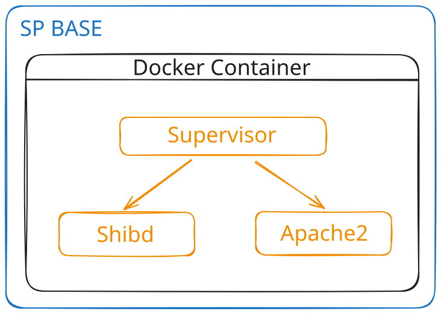

# SP BASE

SP BASE is a service that offers a basic configuration of a Service Provider that can be modified to suit your needs.

(Magari inserire qui le variabili che possono essere usate per la personalizzazione)

## Prerequisites

Docker installation is required to use this repository.

## Architecture

